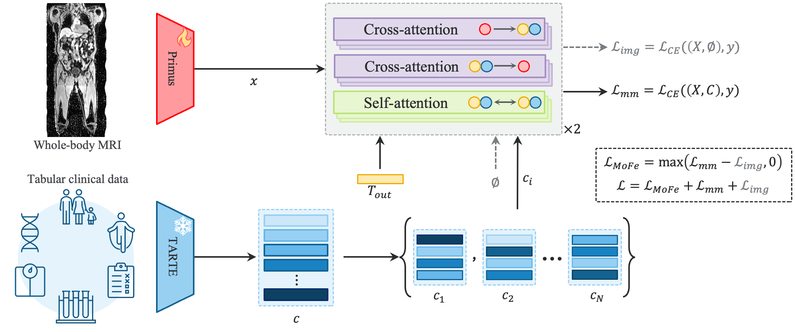

# TACTIC

Official implementation of **"Whole-Body MRI Classification via Prompt-Based Clinical Conditioning"**.

<div align="center">
  
</div>

## Overview

TACTIC is a multimodal framework for whole-body MRI classification that combines WB-MRI information with clinical tabular data through prompt-based conditioning.

This repository contains the code for:

* Whole-body MRI preprocessing
* Image pretraining with Masked Autoencoders (MAE)
* Single-modality image and tabular training
* TACTIC: Multimodal image-tabular training

## Installation

Clone the repository and create the required environment:

```bash
git clone https://github.com/lauradaza/TACTIC.git
cd TACTIC

conda create -n tactic python=3.12
conda activate tactic

pip install -r requirements.txt
```

For GPU training, make sure that the installed PyTorch version is compatible with your CUDA installation.

## Data preparation

We perform our imaging experiments using UK Biobank (UKBB) Dixon MRI images (**Field 20201**).

First, we stitch the individual Dixon images into a full whole-body volume using the preprocessing provided by the [UKBB-GNC-Abdominal-Segmentation repository](https://github.com/BioMedIA/UKBB-GNC-Abdominal-Segmentation/tree/main).

We then extract body masks using:

[`tactic/utils/extract_body_masks.py`](tactic/utils/extract_body_masks.py)

The resulting whole-body images and body masks are used as input for the subsequent pretraining and classification experiments.

For the tabular data, we create csv files with the fields contained in [attributes.py](tactic/utils/attributes.py)

## Pretraining

### Tabular pretraining

For tabular pretraining, we use the official **TARTE** weights.

### Image pretraining

We use a Masked Autoencoder (MAE) for image pretraining.

Run:

```bash
python pretrain.py \
    --task_name {EXPERIMENT_NAME} \
    --masking 0.9 \
    --batch_size 48 \
    --accumulation_steps 20 \
    --num_workers 16 \
    --patch_size 8 8 8 \
    --merge_tokens 4 4 2
```

Our experiments were performed on an NVIDIA GPU with **80 GB of memory**.

If you need to reduce the `batch_size` while maintaining the same effective batch size, adjust `accumulation_steps` according to:
`effective batch size = batch size × accumulation steps`. For example: `48 × 20 = 960`

#### Patch and token configuration

We use `patch_size = [8, 8, 8]` and `merge_tokens = [4, 4, 2]` which results in a token size of: `patch_size × merge_tokens = [32, 32, 16]`

This configuration is used for our mask-aware pooling. Changing `patch_size` or `merge_tokens` changes the number of tokens processed by the transformer and therefore affects both memory consumption and computational cost.

Other important settings for maintaining a relatively small memory footprint are:

* Image size: `[224, 160, 352]`
* Masking ratio: `0.9`

These masking and patch merging settings substantially reduce the number of tokens processed by the transformer.

## Single-modality training

### Images — Primus

To train the image-only model:

```bash
python only_images.py \
    --task_name {EXPERIMENT_NAME} \
    --disease {DISEASE} \
    --checkpoint {PATH/TO/PRETRAINED} \
    --batch_size 48 \
    --accumulation_steps 20 \
    --num_workers 16 \
    --patch_size 8 8 8 \
    --merge_tokens 4 4 2
```

### Tabular — TARTE

To train and evaluate the tabular-only model:

```bash
# Training
python only_tabular.py -s {EXPERIMENT_NAME} --disease {DISEASE}

# Evaluation
python eval_onlyTab.py --name {EXPERIMENT_NAME} --disease {DISEASE}
```

## Multimodal training — TACTIC

To train the multimodal image-tabular model:

```bash
python image_tabular.py \
    --task_name {EXPERIMENT_NAME} \
    --disease {DISEASE} \
    --pretrained_img {PATH/TO/IMG/PRETRAINED} \
    --pretrained_tab {PATH/TO/TAB/PRETRAINED} \
    --freeze_tabular \
    --lr 8e-5 \
    --batch_size 48 \
    --accumulation_steps 20 \
    --num_workers 16 \
    --patch_size 8 8 8 \
    --merge_tokens 4 4 2
```

## Computational requirements

The reported experiments were performed using an **80 GB GPU**.

The main parameters controlling GPU memory usage are:

* `batch_size`
* `accumulation_steps`
* `patch_size`
* `merge_tokens`
* Input image size
* `masking`
* `patch_drop_rate`

When GPU memory is limited, we recommend reducing `batch_size` while increasing `accumulation_steps` to maintain the same effective batch size.

## Citation

If you find this code useful for your research, please cite:

```bibtex
@article{daza2026tactic,
  title   = {Whole-Body MRI Classification via Prompt-Based Clinical Conditioning},
  author  = {Daza, Laura and Hasny, Marta and González, Cristina and Schnabel, Julia A.},
  journal = {MultiTab Workshop at MICCAI},
  year    = {2026}
}
```

## License

This project is released under the license included in this repository. Please see [`LICENSE`](LICENSE) for details.


